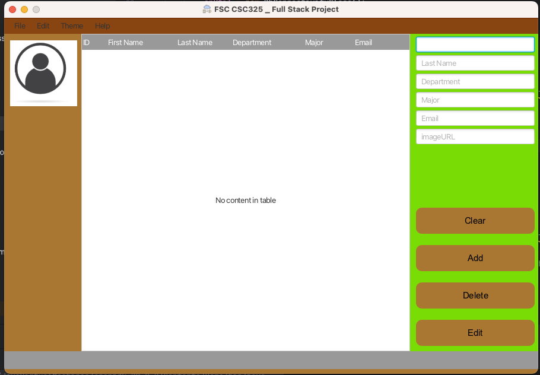

# Task Completion Checklist

## Analyze Design

- [x] Carefully examine the attached image to identify:
    - [x] Layout structure, including menus, menu items, TableView, and other controls
    - [x] Visual elements and their arrangement
    - [x] Spacing, proportions, alignment, and color scheme

## Create JavaFX Structure

- [x] Use the following JavaFX classes:
    - [x] MenuBar, Menu, MenuItem for menu components
    - [x] TableView, TableColumn for the TableView
    - [x] Other appropriate classes for layout and controls
- [x] Organize elements within a Scene and Stage

## Apply CSS Styling

- [x] Create a CSS file and link it to your application
- [x] Style elements to match the design, paying attention to:
    - [x] Menu styling (background, text color, font, spacing)
    - [x] TableView styling (headers, rows, columns, borders, selection)
    - [x] Overall visual consistency

## Implement Functionality (Extra Credit)

- [x] Add event handlers for menu actions, table interactions, and other required functionality
- [x] Implement logic for any dynamic data display or user interactions

## Expected

## Actual

